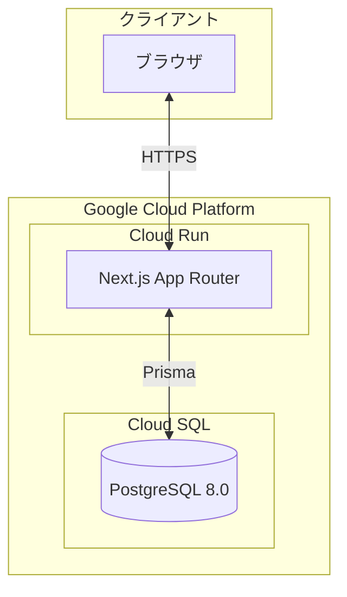
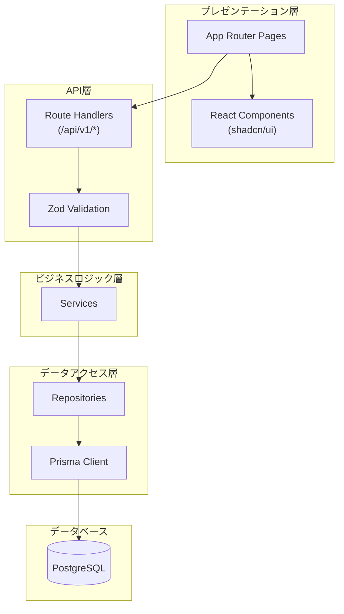
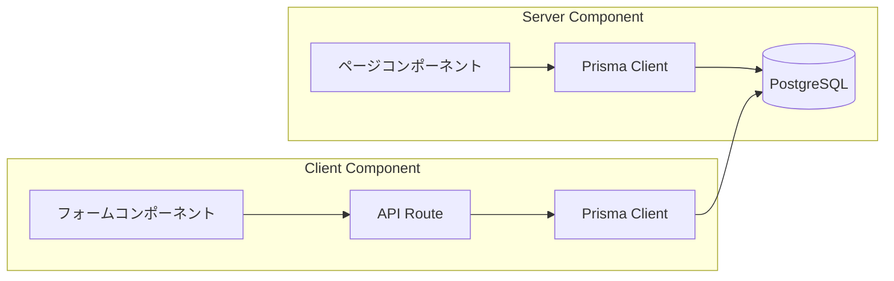

# 営業日報システム

## プロジェクト概要

営業担当者が日々の活動を報告し、上長がフィードバックを行うための日報管理システム。

### 主な機能
- 日報の作成・編集・閲覧
- 訪問記録の管理（1日報に複数件）
- 上長によるコメント機能
- 顧客マスタ管理
- 営業マスタ管理

### ユーザー種別
- **一般営業**: 日報作成、顧客管理
- **管理者**: 上記 + 営業管理、コメント投稿

---

## 設計ドキュメント

### データベース設計
@docs/database_design.md

### データスキーマ（Prisma）
@prisma/schema.prisma

### 画面設計
@docs/screen_design.md

### API仕様
@docs/api_specification.md

### テスト仕様
@docs/test_specification.md

---

## 使用技術

| 項目 | 技術 |
|------|------|
| 言語 | TypeScript |
| フレームワーク | Next.js (App Router) |
| UIコンポーネント | shadcn/ui + Tailwind CSS |
| APIスキーマ定義 | OpenAPI (Zodによる検証) |
| DBスキーマ定義 | Prisma.js |
| データベース | PostgreSQL |
| テスト | Vitest |
| デプロイ | Google Cloud Run |

---

## アーキテクチャ

### システム構成図



### アプリケーションアーキテクチャ



### レイヤー構成

| レイヤー | 責務 | 主要技術 |
|---------|------|----------|
| プレゼンテーション層 | UI表示、ユーザー操作 | React, shadcn/ui, Tailwind CSS |
| API層 | HTTPリクエスト処理、バリデーション | Next.js Route Handlers, Zod |
| ビジネスロジック層 | 業務ロジック、トランザクション管理 | TypeScript |
| データアクセス層 | DB操作、クエリ発行 | Prisma |

### コンポーネント設計（Server Component / Client Component）

Next.js App Routerの機能を活用し、サーバーサイドとクライアントサイドの処理を適切に分離しています。

#### Server Components（サーバーサイドレンダリング）

データ取得と表示のみを行う画面はServer Componentとして実装し、パフォーマンスとSEOを最適化しています。

| 画面 | パス | 説明 |
|------|------|------|
| ダッシュボード | `/dashboard` | Prismaで直接データ取得、認証チェック |
| 日報一覧 | `/daily-reports` | サーバーサイドでの検索・フィルタリング |
| 日報詳細 | `/daily-reports/[id]` | 日報データの表示（コメントフォームは除く） |
| 顧客一覧 | `/customers` | サーバーサイドでの検索・フィルタリング |
| 営業一覧 | `/sales-persons` | サーバーサイドでの検索・フィルタリング |

**Server Componentの特徴:**
- Prismaを直接使用してデータ取得（APIルート経由不要）
- `searchParams`を使用したURL駆動の検索（ブックマーク可能）
- `getSession()`による認証チェック
- 初期表示の高速化、SEO対応

#### Client Components（クライアントサイドレンダリング）

ユーザーインタラクションが必要な部分はClient Componentとして実装しています。

| コンポーネント | パス | 用途 |
|---------------|------|------|
| SearchForm | `/components/search-form.tsx` | 検索フォーム（URL更新による検索） |
| CommentForm | `/daily-reports/[id]/_components/comment-form.tsx` | 管理者コメント投稿フォーム |
| 日報作成 | `/daily-reports/new` | フォーム状態管理（useState） |
| 日報編集 | `/daily-reports/[id]/edit` | フォーム状態管理 |
| 顧客登録 | `/customers/new` | フォーム状態管理 |
| 顧客編集 | `/customers/[id]/edit` | フォーム状態管理 |
| 営業登録 | `/sales-persons/new` | フォーム状態管理 |
| 営業編集 | `/sales-persons/[id]/edit` | フォーム状態管理 |
| ログイン | `/login` | ログインフォーム |

**Client Componentの特徴:**
- `'use client'`ディレクティブを使用
- `useState`, `useEffect`などのReact Hooksを使用
- フォーム入力、バリデーション、送信処理
- `useRouter`によるクライアントサイドナビゲーション

#### データフローの違い



| 項目 | Server Component | Client Component |
|------|-----------------|------------------|
| データ取得 | Prismaを直接使用 | fetch()でAPI呼び出し |
| 認証チェック | `getSession()` | APIルート側で実施 |
| 検索 | URL searchParams | useState + URLパラメータ更新 |
| 状態管理 | 不要 | useState |
| レンダリング | サーバーサイド | クライアントサイド |

### ディレクトリ構成

```
src/
├── app/                      # Next.js App Router
│   ├── (auth)/              # 認証グループ（Client Component）
│   │   └── login/
│   │       └── page.tsx     # 'use client' - ログインフォーム
│   ├── (main)/              # メイングループ（認証必須）
│   │   ├── layout.tsx       # 共通レイアウト
│   │   ├── dashboard/
│   │   │   └── page.tsx     # Server Component - Prisma直接使用
│   │   ├── daily-reports/
│   │   │   ├── page.tsx     # Server Component - 一覧表示
│   │   │   ├── new/
│   │   │   │   └── page.tsx # 'use client' - 作成フォーム
│   │   │   └── [id]/
│   │   │       ├── page.tsx # Server Component - 詳細表示
│   │   │       ├── _components/
│   │   │       │   └── comment-form.tsx  # 'use client' - コメントフォーム
│   │   │       └── edit/
│   │   │           └── page.tsx # 'use client' - 編集フォーム
│   │   ├── customers/
│   │   │   ├── page.tsx     # Server Component - 一覧表示
│   │   │   ├── new/
│   │   │   │   └── page.tsx # 'use client' - 登録フォーム
│   │   │   └── [id]/
│   │   │       └── edit/
│   │   │           └── page.tsx # 'use client' - 編集フォーム
│   │   └── sales-persons/
│   │       ├── page.tsx     # Server Component - 一覧表示
│   │       ├── new/
│   │       │   └── page.tsx # 'use client' - 登録フォーム
│   │       └── [id]/
│   │           └── edit/
│   │               └── page.tsx # 'use client' - 編集フォーム
│   ├── api/                  # API Route Handlers（Client Componentから呼び出し）
│   │   └── v1/
│   │       ├── auth/
│   │       │   ├── login/route.ts
│   │       │   ├── logout/route.ts
│   │       │   └── me/route.ts
│   │       ├── daily-reports/
│   │       │   ├── route.ts
│   │       │   └── [id]/
│   │       │       ├── route.ts
│   │       │       └── comments/route.ts
│   │       ├── customers/
│   │       │   ├── route.ts
│   │       │   └── [id]/route.ts
│   │       ├── sales-persons/
│   │       │   ├── route.ts
│   │       │   └── [id]/route.ts
│   │       └── masters/
│   │           └── customers/route.ts
│   ├── layout.tsx
│   ├── page.tsx             # ルートページ（/login へリダイレクト）
│   └── globals.css
├── components/               # UIコンポーネント
│   ├── ui/                  # shadcn/ui コンポーネント（Client Component）
│   │   ├── button.tsx
│   │   ├── input.tsx
│   │   ├── card.tsx
│   │   ├── table.tsx
│   │   ├── select.tsx
│   │   ├── textarea.tsx
│   │   ├── label.tsx
│   │   └── toast.tsx
│   └── search-form.tsx      # 'use client' - 検索フォーム共通コンポーネント
├── lib/                      # ユーティリティ
│   ├── prisma.ts            # Prismaクライアント（シングルトン）
│   ├── auth.ts              # 認証ユーティリティ（getSession等）
│   └── utils.ts             # 共通ユーティリティ（cn関数等）
└── middleware.ts             # Next.js ミドルウェア（認証チェック）
```

**コンポーネント種別の凡例:**
- `Server Component`: デフォルト。Prismaを直接使用可能
- `'use client'`: Client Component。useState, useEffect等を使用

---

## 開発ルール

### コーディング規約

#### 命名規則
- **テーブル名**: 大文字スネークケース（例: `SALES_PERSON`）
- **カラム名**: 小文字スネークケース（例: `created_at`）
- **API エンドポイント**: ケバブケース（例: `/daily-reports`）
- **変数・関数**: キャメルケース（例: `salesPerson`）
- **クラス・型**: パスカルケース（例: `DailyReport`）

#### 主要ディレクトリの役割
| ディレクトリ | 役割 |
|-------------|------|
| `src/app/` | ページ・APIルート（App Router） |
| `src/components/` | UIコンポーネント |
| `src/services/` | ビジネスロジック |
| `src/repositories/` | データアクセス層 |
| `src/schemas/` | Zodバリデーションスキーマ |
| `src/types/` | TypeScript型定義 |
| `src/lib/` | ユーティリティ関数 |

### Git運用

#### ブランチ戦略
- `main`: 本番環境
- `develop`: 開発環境
- `feature/*`: 機能開発
- `fix/*`: バグ修正
- `hotfix/*`: 緊急修正

#### コミットメッセージ
```
<type>: <subject>

<body>
```

**type**:
- `feat`: 新機能
- `fix`: バグ修正
- `docs`: ドキュメント
- `refactor`: リファクタリング
- `test`: テスト
- `chore`: その他

### APIレスポンス形式

#### 成功時
```json
{
  "success": true,
  "data": { ... }
}
```

#### エラー時
```json
{
  "success": false,
  "error": {
    "code": "ERROR_CODE",
    "message": "エラーメッセージ"
  }
}
```

---

## テーブル一覧

| テーブル名 | 論理名 | 説明 |
|-----------|--------|------|
| SALES_PERSON | 営業マスタ | 営業担当者情報 |
| CUSTOMER | 顧客マスタ | 顧客情報 |
| DAILY_REPORT | 日報 | 日報情報 |
| VISIT_RECORD | 訪問記録 | 顧客訪問の記録 |
| MANAGER_COMMENT | 上長コメント | 日報へのコメント |

---

## 画面一覧

| 画面ID | 画面名 | 概要 |
|--------|--------|------|
| SCR-001 | ログイン | システムログイン |
| SCR-002 | ダッシュボード | ホーム画面 |
| SCR-010 | 日報一覧 | 日報の検索・一覧 |
| SCR-011 | 日報作成 | 新規日報作成 |
| SCR-012 | 日報編集 | 日報の編集 |
| SCR-013 | 日報詳細 | 日報詳細・コメント |
| SCR-020 | 顧客一覧 | 顧客マスタ一覧 |
| SCR-021 | 顧客登録 | 新規顧客登録 |
| SCR-022 | 顧客編集 | 顧客情報編集 |
| SCR-030 | 営業一覧 | 営業マスタ一覧 |
| SCR-031 | 営業登録 | 新規営業登録 |
| SCR-032 | 営業編集 | 営業情報編集 |

---

## API一覧

| メソッド | エンドポイント | 概要 | 権限 |
|---------|---------------|------|------|
| POST | /auth/login | ログイン | - |
| POST | /auth/logout | ログアウト | 全員 |
| GET | /auth/me | ユーザー情報取得 | 全員 |
| GET | /dashboard | ダッシュボード | 全員 |
| GET | /daily-reports | 日報一覧 | 全員 |
| POST | /daily-reports | 日報作成 | 営業 |
| GET | /daily-reports/:id | 日報詳細 | 全員 |
| PUT | /daily-reports/:id | 日報更新 | 本人 |
| DELETE | /daily-reports/:id | 日報削除 | 本人 |
| POST | /daily-reports/:id/comments | コメント投稿 | 管理者 |
| GET | /customers | 顧客一覧 | 全員 |
| POST | /customers | 顧客作成 | 全員 |
| GET | /customers/:id | 顧客詳細 | 全員 |
| PUT | /customers/:id | 顧客更新 | 全員 |
| DELETE | /customers/:id | 顧客削除 | 管理者 |
| GET | /sales-persons | 営業一覧 | 管理者 |
| POST | /sales-persons | 営業作成 | 管理者 |
| GET | /sales-persons/:id | 営業詳細 | 管理者 |
| PUT | /sales-persons/:id | 営業更新 | 管理者 |
| DELETE | /sales-persons/:id | 営業削除 | 管理者 |
