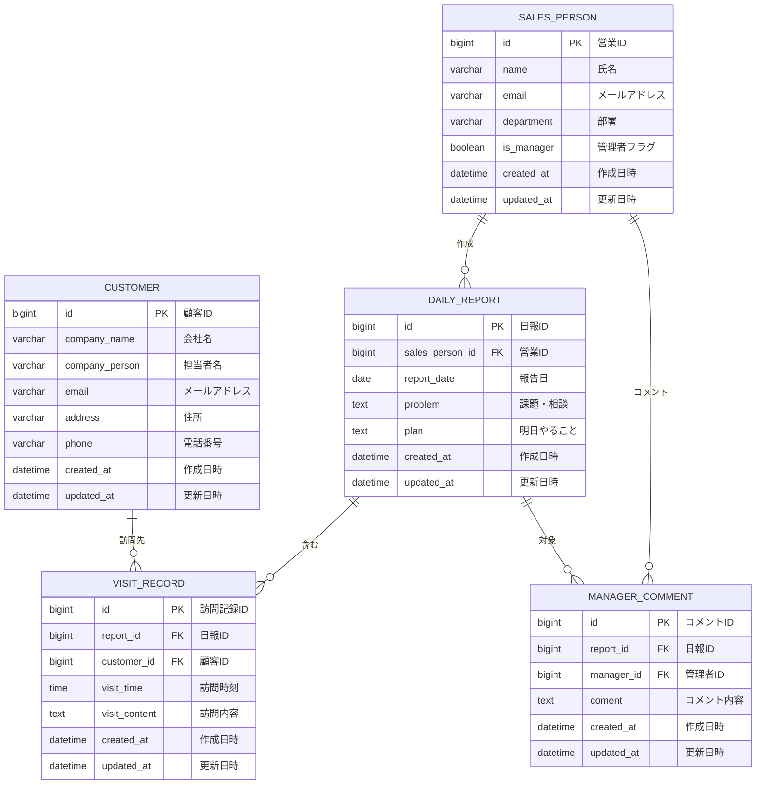

# 営業日報システム データベース設計書

## 1. ER図

---

## 2. テーブル一覧

| No | テーブル名 | 論理名 | 説明 |
|----|-----------|--------|------|
| 1 | SALES_PERSON | 営業マスタ | 営業担当者情報を管理 |
| 2 | CUSTOMER | 顧客マスタ | 顧客情報を管理 |
| 3 | DAILY_REPORT | 日報 | 日報情報を管理（1営業1日1件） |
| 4 | VISIT_RECORD | 訪問記録 | 顧客訪問の記録（日報に複数紐づく） |
| 5 | MANAGER_COMMENT | 上長コメント | 上長から日報へのコメント（日報に複数紐づく） |

---

## 3. テーブル定義

### 3.1 SALES_PERSON（営業マスタ）

営業担当者の情報を管理するマスタテーブル

| No | カラム名 | 論理名 | データ型 | PK | FK | NOT NULL | デフォルト | 説明 |
|----|----------|--------|----------|----|----|----------|------------|------|
| 1 | id | 営業ID | BIGINT | ○ | | ○ | AUTO_INCREMENT | 主キー |
| 2 | name | 氏名 | VARCHAR(100) | | | ○ | | 営業担当者の氏名 |
| 3 | email | メールアドレス | VARCHAR(255) | | | ○ | | ログイン用メールアドレス（UNIQUE） |
| 4 | department | 部署 | VARCHAR(100) | | | | NULL | 所属部署 |
| 5 | is_manager | 管理者フラグ | BOOLEAN | | | ○ | FALSE | 管理者:TRUE、一般:FALSE |
| 6 | created_at | 作成日時 | DATETIME | | | ○ | CURRENT_TIMESTAMP | レコード作成日時 |
| 7 | updated_at | 更新日時 | DATETIME | | | ○ | CURRENT_TIMESTAMP | レコード更新日時 |

**インデックス**
| インデックス名 | カラム | 種類 |
|---------------|--------|------|
| PRIMARY | id | PRIMARY KEY |
| UK_SALES_PERSON_EMAIL | email | UNIQUE |
| IDX_SALES_PERSON_DEPARTMENT | department | INDEX |

---

### 3.2 CUSTOMER（顧客マスタ）

顧客情報を管理するマスタテーブル

| No | カラム名 | 論理名 | データ型 | PK | FK | NOT NULL | デフォルト | 説明 |
|----|----------|--------|----------|----|----|----------|------------|------|
| 1 | id | 顧客ID | BIGINT | ○ | | ○ | AUTO_INCREMENT | 主キー |
| 2 | company_name | 会社名 | VARCHAR(200) | | | ○ | | 顧客の会社名 |
| 3 | company_person | 担当者名 | VARCHAR(100) | | | | NULL | 顧客側の担当者名 |
| 4 | email | メールアドレス | VARCHAR(255) | | | | NULL | 顧客のメールアドレス |
| 5 | address | 住所 | VARCHAR(500) | | | | NULL | 顧客の住所 |
| 6 | phone | 電話番号 | VARCHAR(20) | | | | NULL | 顧客の電話番号 |
| 7 | created_at | 作成日時 | DATETIME | | | ○ | CURRENT_TIMESTAMP | レコード作成日時 |
| 8 | updated_at | 更新日時 | DATETIME | | | ○ | CURRENT_TIMESTAMP | レコード更新日時 |

**インデックス**
| インデックス名 | カラム | 種類 |
|---------------|--------|------|
| PRIMARY | id | PRIMARY KEY |
| IDX_CUSTOMER_COMPANY_NAME | company_name | INDEX |

---

### 3.3 DAILY_REPORT（日報）

営業日報を管理するテーブル

| No | カラム名 | 論理名 | データ型 | PK | FK | NOT NULL | デフォルト | 説明 |
|----|----------|--------|----------|----|----|----------|------------|------|
| 1 | id | 日報ID | BIGINT | ○ | | ○ | AUTO_INCREMENT | 主キー |
| 2 | sales_person_id | 営業ID | BIGINT | | ○ | ○ | | 日報作成者の営業ID |
| 3 | report_date | 報告日 | DATE | | | ○ | | 日報の対象日 |
| 4 | problem | 課題・相談 | TEXT | | | | NULL | 現在の課題や相談事項 |
| 5 | plan | 明日やること | TEXT | | | | NULL | 翌日の予定・計画 |
| 6 | created_at | 作成日時 | DATETIME | | | ○ | CURRENT_TIMESTAMP | レコード作成日時 |
| 7 | updated_at | 更新日時 | DATETIME | | | ○ | CURRENT_TIMESTAMP | レコード更新日時 |

**インデックス**
| インデックス名 | カラム | 種類 |
|---------------|--------|------|
| PRIMARY | id | PRIMARY KEY |
| UK_DAILY_REPORT_PERSON_DATE | sales_person_id, report_date | UNIQUE |
| IDX_DAILY_REPORT_DATE | report_date | INDEX |

**外部キー**
| 制約名 | カラム | 参照テーブル | 参照カラム |
|--------|--------|-------------|------------|
| FK_DAILY_REPORT_SALES_PERSON | sales_person_id | SALES_PERSON | id |

---

### 3.4 VISIT_RECORD（訪問記録）

顧客訪問の記録を管理するテーブル

| No | カラム名 | 論理名 | データ型 | PK | FK | NOT NULL | デフォルト | 説明 |
|----|----------|--------|----------|----|----|----------|------------|------|
| 1 | id | 訪問記録ID | BIGINT | ○ | | ○ | AUTO_INCREMENT | 主キー |
| 2 | report_id | 日報ID | BIGINT | | ○ | ○ | | 紐づく日報のID |
| 3 | customer_id | 顧客ID | BIGINT | | ○ | ○ | | 訪問先の顧客ID |
| 4 | visit_time | 訪問時刻 | TIME | | | | NULL | 訪問した時刻 |
| 5 | visit_content | 訪問内容 | TEXT | | | ○ | | 訪問時の活動内容・商談内容 |
| 6 | created_at | 作成日時 | DATETIME | | | ○ | CURRENT_TIMESTAMP | レコード作成日時 |
| 7 | updated_at | 更新日時 | DATETIME | | | ○ | CURRENT_TIMESTAMP | レコード更新日時 |

**インデックス**
| インデックス名 | カラム | 種類 |
|---------------|--------|------|
| PRIMARY | id | PRIMARY KEY |
| IDX_VISIT_RECORD_REPORT | report_id | INDEX |
| IDX_VISIT_RECORD_CUSTOMER | customer_id | INDEX |

**外部キー**
| 制約名 | カラム | 参照テーブル | 参照カラム |
|--------|--------|-------------|------------|
| FK_VISIT_RECORD_REPORT | report_id | DAILY_REPORT | id |
| FK_VISIT_RECORD_CUSTOMER | customer_id | CUSTOMER | id |

---

### 3.5 MANAGER_COMMENT（上長コメント）

上長から日報へのコメントを管理するテーブル

| No | カラム名 | 論理名 | データ型 | PK | FK | NOT NULL | デフォルト | 説明 |
|----|----------|--------|----------|----|----|----------|------------|------|
| 1 | id | コメントID | BIGINT | ○ | | ○ | AUTO_INCREMENT | 主キー |
| 2 | report_id | 日報ID | BIGINT | | ○ | ○ | | コメント対象の日報ID |
| 3 | manager_id | 管理者ID | BIGINT | | ○ | ○ | | コメントした上長の営業ID |
| 4 | coment | コメント内容 | TEXT | | | ○ | | コメント本文 |
| 5 | created_at | 作成日時 | DATETIME | | | ○ | CURRENT_TIMESTAMP | レコード作成日時 |
| 6 | updated_at | 更新日時 | DATETIME | | | ○ | CURRENT_TIMESTAMP | レコード更新日時 |

**インデックス**
| インデックス名 | カラム | 種類 |
|---------------|--------|------|
| PRIMARY | id | PRIMARY KEY |
| IDX_MANAGER_COMMENT_REPORT | report_id | INDEX |
| IDX_MANAGER_COMMENT_MANAGER | manager_id | INDEX |

**外部キー**
| 制約名 | カラム | 参照テーブル | 参照カラム |
|--------|--------|-------------|------------|
| FK_MANAGER_COMMENT_REPORT | report_id | DAILY_REPORT | id |
| FK_MANAGER_COMMENT_MANAGER | manager_id | SALES_PERSON | id |
