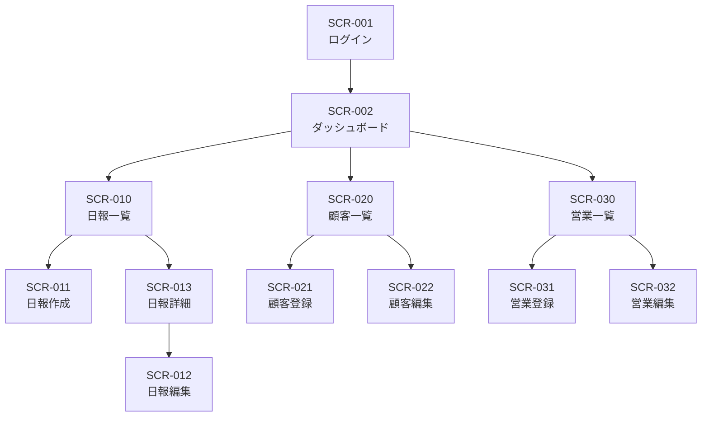

# 営業日報システム 画面定義書

## 1. 画面一覧

| No | 画面ID | 画面名 | 概要 | アクセス権限 | コンポーネント種別 |
|----|--------|--------|------|-------------|------------------|
| 1 | SCR-001 | ログイン | システムへのログイン | 全員 | Client Component |
| 2 | SCR-002 | ダッシュボード | ホーム画面、日報状況の確認 | 営業・管理者 | Server Component |
| 3 | SCR-010 | 日報一覧 | 日報の検索・一覧表示 | 営業・管理者 | Server Component |
| 4 | SCR-011 | 日報作成 | 新規日報の作成 | 営業 | Client Component |
| 5 | SCR-012 | 日報編集 | 既存日報の編集 | 営業（本人のみ） | Client Component |
| 6 | SCR-013 | 日報詳細 | 日報の詳細表示・コメント | 営業・管理者 | Server Component（※1） |
| 7 | SCR-020 | 顧客一覧 | 顧客マスタの検索・一覧表示 | 営業・管理者 | Server Component |
| 8 | SCR-021 | 顧客登録 | 新規顧客の登録 | 営業・管理者 | Client Component |
| 9 | SCR-022 | 顧客編集 | 既存顧客の編集 | 営業・管理者 | Client Component |
| 10 | SCR-030 | 営業一覧 | 営業マスタの検索・一覧表示 | 管理者 | Server Component |
| 11 | SCR-031 | 営業登録 | 新規営業担当者の登録 | 管理者 | Client Component |
| 12 | SCR-032 | 営業編集 | 既存営業担当者の編集 | 管理者 | Client Component |

※1: コメント投稿フォーム部分のみClient Component

### コンポーネント種別について

| 種別 | 説明 | 主な用途 |
|------|------|----------|
| Server Component | サーバーサイドでレンダリング。Prismaで直接データ取得 | 一覧画面、詳細画面、ダッシュボード |
| Client Component | クライアントサイドでレンダリング。useState等のHooksを使用 | フォーム入力、インタラクティブな操作 |

---

## 2. 画面遷移図



---

## 3. 画面定義詳細

---

### 3.1 SCR-001 ログイン

#### 基本情報
| 項目 | 内容 |
|------|------|
| 画面ID | SCR-001 |
| 画面名 | ログイン |
| 概要 | システムへのログイン認証を行う |
| アクセス権限 | 全員 |

#### 画面レイアウト
```
+------------------------------------------+
|            営業日報システム                |
|                                          |
|  +------------------------------------+  |
|  | メールアドレス                      |  |
|  | [                                ] |  |
|  +------------------------------------+  |
|                                          |
|  +------------------------------------+  |
|  | パスワード                          |  |
|  | [                                ] |  |
|  +------------------------------------+  |
|                                          |
|          [    ログイン    ]              |
|                                          |
+------------------------------------------+
```

#### 画面項目
| No | 項目ID | 項目名 | 種別 | 必須 | 備考 |
|----|--------|--------|------|------|------|
| 1 | email | メールアドレス | テキスト入力 | ○ | メール形式チェック |
| 2 | password | パスワード | パスワード入力 | ○ | マスク表示 |
| 3 | btn_login | ログインボタン | ボタン | - | 認証処理実行 |

#### アクション
| No | アクション | 処理内容 | 遷移先 |
|----|-----------|----------|--------|
| 1 | ログインボタン押下 | 認証処理、成功時ダッシュボードへ | SCR-002 |

---

### 3.2 SCR-002 ダッシュボード

#### 基本情報
| 項目 | 内容 |
|------|------|
| 画面ID | SCR-002 |
| 画面名 | ダッシュボード |
| 概要 | ホーム画面、本日の日報状況確認 |
| アクセス権限 | 営業・管理者 |
| コンポーネント種別 | Server Component |

#### 実装詳細
- **データ取得**: Prismaを直接使用してサーバーサイドでデータ取得
- **認証**: `getSession()`でサーバーサイド認証チェック
- **パフォーマンス**: APIルート経由なし、初期表示高速化

#### 画面レイアウト
```
+----------------------------------------------------------+
| [ロゴ]  日報一覧  顧客管理  営業管理    ○○さん [ログアウト] |
+----------------------------------------------------------+
|                                                          |
|  本日: 2025/01/12                                        |
|                                                          |
|  +------------------------+  +------------------------+  |
|  | 本日の日報状況          |  | 未読コメント            |  |
|  |                        |  |                        |  |
|  | ○ 作成済み / × 未作成   |  | 3件                    |  |
|  |                        |  |                        |  |
|  | [日報を作成する]        |  | [確認する]              |  |
|  +------------------------+  +------------------------+  |
|                                                          |
|  +----------------------------------------------------+  |
|  | 最近の日報                                          |  |
|  | +------------------------------------------------+ |  |
|  | | 2025/01/11 | 訪問3件 | コメント1件              | |  |
|  | | 2025/01/10 | 訪問2件 | コメント0件              | |  |
|  | | 2025/01/09 | 訪問4件 | コメント2件              | |  |
|  | +------------------------------------------------+ |  |
|  +----------------------------------------------------+  |
|                                                          |
+----------------------------------------------------------+
```

#### 画面項目
| No | 項目ID | 項目名 | 種別 | 備考 |
|----|--------|--------|------|------|
| 1 | today_status | 本日の日報状況 | 表示 | 作成済み/未作成 |
| 2 | unread_comments | 未読コメント数 | 表示 | 件数表示 |
| 3 | recent_reports | 最近の日報一覧 | リスト | 直近5件表示 |
| 4 | btn_create_report | 日報を作成するボタン | ボタン | 日報作成画面へ |

#### アクション
| No | アクション | 処理内容 | 遷移先 |
|----|-----------|----------|--------|
| 1 | 日報を作成するボタン押下 | 日報作成画面へ遷移 | SCR-011 |
| 2 | 確認するボタン押下 | 日報一覧（未読フィルタ）へ遷移 | SCR-010 |
| 3 | 最近の日報行クリック | 日報詳細画面へ遷移 | SCR-013 |

---

### 3.3 SCR-010 日報一覧

#### 基本情報
| 項目 | 内容 |
|------|------|
| 画面ID | SCR-010 |
| 画面名 | 日報一覧 |
| 概要 | 日報の検索・一覧表示 |
| アクセス権限 | 営業・管理者 |
| コンポーネント種別 | Server Component + Client Component（検索フォーム） |

#### 実装詳細
- **データ取得**: Prismaを直接使用、URL searchParamsで検索条件を受け取り
- **検索フォーム**: SearchForm（Client Component）でURL更新による検索
- **特徴**: ブックマーク可能なURL、サーバーサイドフィルタリング

#### 画面レイアウト
```
+----------------------------------------------------------+
| [ロゴ]  日報一覧  顧客管理  営業管理    ○○さん [ログアウト] |
+----------------------------------------------------------+
|                                                          |
|  日報一覧                              [+ 新規作成]       |
|                                                          |
|  +----------------------------------------------------+  |
|  | 検索条件                                            |  |
|  | 報告日: [    ] ～ [    ]  営業担当: [▼選択    ]     |  |
|  |                                    [検索] [クリア]  |  |
|  +----------------------------------------------------+  |
|                                                          |
|  +----------------------------------------------------+  |
|  | 報告日     | 営業担当 | 訪問件数 | コメント | 操作   |  |
|  |------------|---------|---------|---------|--------|  |
|  | 2025/01/11 | 田中太郎 | 3件     | 1件     | [詳細] |  |
|  | 2025/01/11 | 山田花子 | 2件     | 0件     | [詳細] |  |
|  | 2025/01/10 | 田中太郎 | 4件     | 2件     | [詳細] |  |
|  +----------------------------------------------------+  |
|                                                          |
|  < 1 2 3 ... 10 >                                        |
|                                                          |
+----------------------------------------------------------+
```

#### 画面項目
| No | 項目ID | 項目名 | 種別 | 必須 | 備考 |
|----|--------|--------|------|------|------|
| 1 | search_date_from | 報告日（開始） | 日付入力 | - | カレンダー選択 |
| 2 | search_date_to | 報告日（終了） | 日付入力 | - | カレンダー選択 |
| 3 | search_sales_person | 営業担当 | プルダウン | - | 管理者のみ全員選択可 |
| 4 | btn_search | 検索ボタン | ボタン | - | 検索実行 |
| 5 | btn_clear | クリアボタン | ボタン | - | 条件クリア |
| 6 | btn_create | 新規作成ボタン | ボタン | - | 日報作成画面へ |
| 7 | report_list | 日報一覧 | テーブル | - | 検索結果表示 |

#### アクション
| No | アクション | 処理内容 | 遷移先 |
|----|-----------|----------|--------|
| 1 | 検索ボタン押下 | 検索条件で日報を検索 | - |
| 2 | クリアボタン押下 | 検索条件をクリア | - |
| 3 | 新規作成ボタン押下 | 日報作成画面へ遷移 | SCR-011 |
| 4 | 詳細ボタン押下 | 日報詳細画面へ遷移 | SCR-013 |

---

### 3.4 SCR-011 日報作成

#### 基本情報
| 項目 | 内容 |
|------|------|
| 画面ID | SCR-011 |
| 画面名 | 日報作成 |
| 概要 | 新規日報の作成 |
| アクセス権限 | 営業 |
| コンポーネント種別 | Client Component |

#### 実装詳細
- **状態管理**: useStateでフォーム状態を管理
- **データ送信**: fetch()でAPIルートに送信
- **動的フォーム**: 訪問記録の行追加・削除

#### 画面レイアウト
```
+----------------------------------------------------------+
| [ロゴ]  日報一覧  顧客管理  営業管理    ○○さん [ログアウト] |
+----------------------------------------------------------+
|                                                          |
|  日報作成                                                 |
|                                                          |
|  +----------------------------------------------------+  |
|  | 報告日: [2025/01/12  ▼]                             |  |
|  +----------------------------------------------------+  |
|                                                          |
|  +----------------------------------------------------+  |
|  | 訪問記録                              [+ 行追加]    |  |
|  | +------------------------------------------------+ |  |
|  | | No | 顧客名      | 訪問時刻 | 訪問内容    | 削除 | |  |
|  | |----|------------|---------|------------|------| |  |
|  | | 1  | [▼選択   ] | [     ] | [        ] | [×]  | |  |
|  | | 2  | [▼選択   ] | [     ] | [        ] | [×]  | |  |
|  | +------------------------------------------------+ |  |
|  +----------------------------------------------------+  |
|                                                          |
|  +----------------------------------------------------+  |
|  | 課題・相談（Problem）                               |  |
|  | +------------------------------------------------+ |  |
|  | |                                                | |  |
|  | |                                                | |  |
|  | +------------------------------------------------+ |  |
|  +----------------------------------------------------+  |
|                                                          |
|  +----------------------------------------------------+  |
|  | 明日やること（Plan）                                |  |
|  | +------------------------------------------------+ |  |
|  | |                                                | |  |
|  | |                                                | |  |
|  | +------------------------------------------------+ |  |
|  +----------------------------------------------------+  |
|                                                          |
|  [キャンセル]                              [保存]        |
|                                                          |
+----------------------------------------------------------+
```

#### 画面項目
| No | 項目ID | 項目名 | 種別 | 必須 | 備考 |
|----|--------|--------|------|------|------|
| 1 | report_date | 報告日 | 日付入力 | ○ | デフォルト本日 |
| 2 | visit_records | 訪問記録 | 動的テーブル | - | 複数行追加可 |
| 2-1 | customer_id | 顧客名 | プルダウン | ○ | 顧客マスタから選択 |
| 2-2 | visit_time | 訪問時刻 | 時刻入力 | - | HH:MM形式 |
| 2-3 | visit_content | 訪問内容 | テキストエリア | ○ | 活動内容を入力 |
| 3 | problem | 課題・相談 | テキストエリア | - | 複数行入力可 |
| 4 | plan | 明日やること | テキストエリア | - | 複数行入力可 |
| 5 | btn_add_row | 行追加ボタン | ボタン | - | 訪問記録行を追加 |
| 6 | btn_delete_row | 削除ボタン | ボタン | - | 訪問記録行を削除 |
| 7 | btn_cancel | キャンセルボタン | ボタン | - | 入力内容を破棄 |
| 8 | btn_save | 保存ボタン | ボタン | - | 日報を保存 |

#### アクション
| No | アクション | 処理内容 | 遷移先 |
|----|-----------|----------|--------|
| 1 | 行追加ボタン押下 | 訪問記録行を追加 | - |
| 2 | 削除ボタン押下 | 該当行を削除 | - |
| 3 | キャンセルボタン押下 | 確認後、日報一覧へ戻る | SCR-010 |
| 4 | 保存ボタン押下 | 入力チェック後、保存して詳細へ | SCR-013 |

---

### 3.5 SCR-012 日報編集

#### 基本情報
| 項目 | 内容 |
|------|------|
| 画面ID | SCR-012 |
| 画面名 | 日報編集 |
| 概要 | 既存日報の編集 |
| アクセス権限 | 営業（本人のみ） |

#### 画面レイアウト
SCR-011（日報作成）と同様

#### 画面項目
SCR-011（日報作成）と同様

#### アクション
| No | アクション | 処理内容 | 遷移先 |
|----|-----------|----------|--------|
| 1 | 保存ボタン押下 | 入力チェック後、更新して詳細へ | SCR-013 |
| 2 | キャンセルボタン押下 | 確認後、日報詳細へ戻る | SCR-013 |

---

### 3.6 SCR-013 日報詳細

#### 基本情報
| 項目 | 内容 |
|------|------|
| 画面ID | SCR-013 |
| 画面名 | 日報詳細 |
| 概要 | 日報の詳細表示、上長コメント |
| アクセス権限 | 営業・管理者 |
| コンポーネント種別 | Server Component + Client Component（コメントフォーム） |

#### 実装詳細
- **データ取得**: Prismaを直接使用してサーバーサイドでデータ取得
- **コメントフォーム**: CommentForm（Client Component）として分離
- **コンポーネント分離**: `_components/comment-form.tsx`として管理
- **リフレッシュ**: コメント投稿後、`router.refresh()`でサーバー再取得

#### 画面レイアウト
```
+----------------------------------------------------------+
| [ロゴ]  日報一覧  顧客管理  営業管理    ○○さん [ログアウト] |
+----------------------------------------------------------+
|                                                          |
|  日報詳細                    [編集] [一覧に戻る]          |
|                                                          |
|  +----------------------------------------------------+  |
|  | 報告日: 2025/01/12        営業担当: 田中太郎        |  |
|  +----------------------------------------------------+  |
|                                                          |
|  +----------------------------------------------------+  |
|  | 訪問記録                                            |  |
|  | +------------------------------------------------+ |  |
|  | | No | 顧客名        | 訪問時刻 | 訪問内容        | |  |
|  | |----|--------------|---------|----------------| |  |
|  | | 1  | 株式会社ABC   | 10:00   | 新製品の提案... | |  |
|  | | 2  | 株式会社XYZ   | 14:00   | 契約更新の...   | |  |
|  | +------------------------------------------------+ |  |
|  +----------------------------------------------------+  |
|                                                          |
|  +----------------------------------------------------+  |
|  | 課題・相談（Problem）                               |  |
|  | 競合他社との価格差について相談したい。              |  |
|  +----------------------------------------------------+  |
|                                                          |
|  +----------------------------------------------------+  |
|  | 明日やること（Plan）                                |  |
|  | ・株式会社ABCへ見積書送付                           |  |
|  | ・新規顧客リストの作成                              |  |
|  +----------------------------------------------------+  |
|                                                          |
|  +----------------------------------------------------+  |
|  | 上長コメント                                        |  |
|  | +------------------------------------------------+ |  |
|  | | 山田部長 2025/01/12 15:30                       | |  |
|  | | 価格については明日相談しましょう。                | |  |
|  | +------------------------------------------------+ |  |
|  |                                                    |  |
|  | ※管理者のみ表示                                    |  |
|  | +------------------------------------------------+ |  |
|  | | コメントを入力...                               | |  |
|  | +------------------------------------------------+ |  |
|  | [コメント投稿]                                      |  |
|  +----------------------------------------------------+  |
|                                                          |
+----------------------------------------------------------+
```

#### 画面項目
| No | 項目ID | 項目名 | 種別 | 備考 |
|----|--------|--------|------|------|
| 1 | report_date | 報告日 | 表示 | - |
| 2 | sales_person_name | 営業担当 | 表示 | - |
| 3 | visit_records | 訪問記録 | テーブル | 読み取り専用 |
| 4 | problem | 課題・相談 | 表示 | - |
| 5 | plan | 明日やること | 表示 | - |
| 6 | comments | 上長コメント一覧 | リスト | 時系列表示 |
| 7 | new_comment | コメント入力 | テキストエリア | 管理者のみ表示 |
| 8 | btn_post_comment | コメント投稿ボタン | ボタン | 管理者のみ表示 |
| 9 | btn_edit | 編集ボタン | ボタン | 本人のみ表示 |
| 10 | btn_back | 一覧に戻るボタン | ボタン | - |

#### アクション
| No | アクション | 処理内容 | 遷移先 |
|----|-----------|----------|--------|
| 1 | 編集ボタン押下 | 日報編集画面へ遷移 | SCR-012 |
| 2 | 一覧に戻るボタン押下 | 日報一覧画面へ遷移 | SCR-010 |
| 3 | コメント投稿ボタン押下 | コメントを保存して画面更新 | - |

---

### 3.7 SCR-020 顧客一覧

#### 基本情報
| 項目 | 内容 |
|------|------|
| 画面ID | SCR-020 |
| 画面名 | 顧客一覧 |
| 概要 | 顧客マスタの検索・一覧表示 |
| アクセス権限 | 営業・管理者 |
| コンポーネント種別 | Server Component + Client Component（検索フォーム） |

#### 実装詳細
- **データ取得**: Prismaを直接使用、URL searchParamsで検索条件を受け取り
- **検索フォーム**: SearchForm（Client Component）でURL更新による検索

#### 画面レイアウト
```
+----------------------------------------------------------+
| [ロゴ]  日報一覧  顧客管理  営業管理    ○○さん [ログアウト] |
+----------------------------------------------------------+
|                                                          |
|  顧客一覧                              [+ 新規登録]       |
|                                                          |
|  +----------------------------------------------------+  |
|  | 検索条件                                            |  |
|  | 会社名: [              ]           [検索] [クリア]  |  |
|  +----------------------------------------------------+  |
|                                                          |
|  +----------------------------------------------------+  |
|  | 会社名       | 担当者名 | 電話番号    | 操作        |  |
|  |-------------|---------|------------|-------------|  |
|  | 株式会社ABC  | 佐藤一郎 | 03-1234-XX | [編集]      |  |
|  | 株式会社XYZ  | 鈴木二郎 | 03-5678-XX | [編集]      |  |
|  +----------------------------------------------------+  |
|                                                          |
|  < 1 2 3 ... 10 >                                        |
|                                                          |
+----------------------------------------------------------+
```

#### 画面項目
| No | 項目ID | 項目名 | 種別 | 必須 | 備考 |
|----|--------|--------|------|------|------|
| 1 | search_company_name | 会社名 | テキスト入力 | - | 部分一致検索 |
| 2 | btn_search | 検索ボタン | ボタン | - | 検索実行 |
| 3 | btn_clear | クリアボタン | ボタン | - | 条件クリア |
| 4 | btn_create | 新規登録ボタン | ボタン | - | 顧客登録画面へ |
| 5 | customer_list | 顧客一覧 | テーブル | - | 検索結果表示 |

#### アクション
| No | アクション | 処理内容 | 遷移先 |
|----|-----------|----------|--------|
| 1 | 新規登録ボタン押下 | 顧客登録画面へ遷移 | SCR-021 |
| 2 | 編集ボタン押下 | 顧客編集画面へ遷移 | SCR-022 |

---

### 3.8 SCR-021 顧客登録

#### 基本情報
| 項目 | 内容 |
|------|------|
| 画面ID | SCR-021 |
| 画面名 | 顧客登録 |
| 概要 | 新規顧客の登録 |
| アクセス権限 | 営業・管理者 |

#### 画面レイアウト
```
+----------------------------------------------------------+
| [ロゴ]  日報一覧  顧客管理  営業管理    ○○さん [ログアウト] |
+----------------------------------------------------------+
|                                                          |
|  顧客登録                                                 |
|                                                          |
|  +----------------------------------------------------+  |
|  | 会社名 *                                            |  |
|  | [                                                ] |  |
|  +----------------------------------------------------+  |
|                                                          |
|  +----------------------------------------------------+  |
|  | 担当者名                                            |  |
|  | [                                                ] |  |
|  +----------------------------------------------------+  |
|                                                          |
|  +----------------------------------------------------+  |
|  | メールアドレス                                       |  |
|  | [                                                ] |  |
|  +----------------------------------------------------+  |
|                                                          |
|  +----------------------------------------------------+  |
|  | 住所                                                |  |
|  | [                                                ] |  |
|  +----------------------------------------------------+  |
|                                                          |
|  +----------------------------------------------------+  |
|  | 電話番号                                            |  |
|  | [                                                ] |  |
|  +----------------------------------------------------+  |
|                                                          |
|  [キャンセル]                              [登録]        |
|                                                          |
+----------------------------------------------------------+
```

#### 画面項目
| No | 項目ID | 項目名 | 種別 | 必須 | 備考 |
|----|--------|--------|------|------|------|
| 1 | company_name | 会社名 | テキスト入力 | ○ | 最大200文字 |
| 2 | company_person | 担当者名 | テキスト入力 | - | 最大100文字 |
| 3 | email | メールアドレス | テキスト入力 | - | メール形式チェック |
| 4 | address | 住所 | テキスト入力 | - | 最大500文字 |
| 5 | phone | 電話番号 | テキスト入力 | - | 最大20文字 |
| 6 | btn_cancel | キャンセルボタン | ボタン | - | 顧客一覧へ戻る |
| 7 | btn_save | 登録ボタン | ボタン | - | 顧客を登録 |

#### アクション
| No | アクション | 処理内容 | 遷移先 |
|----|-----------|----------|--------|
| 1 | キャンセルボタン押下 | 顧客一覧へ戻る | SCR-020 |
| 2 | 登録ボタン押下 | 入力チェック後、保存して一覧へ | SCR-020 |

---

### 3.9 SCR-022 顧客編集

#### 基本情報
| 項目 | 内容 |
|------|------|
| 画面ID | SCR-022 |
| 画面名 | 顧客編集 |
| 概要 | 既存顧客の編集 |
| アクセス権限 | 営業・管理者 |

#### 画面レイアウト
SCR-021（顧客登録）と同様

#### 画面項目
SCR-021（顧客登録）と同様（ボタンは「更新」に変更）

#### アクション
| No | アクション | 処理内容 | 遷移先 |
|----|-----------|----------|--------|
| 1 | キャンセルボタン押下 | 顧客一覧へ戻る | SCR-020 |
| 2 | 更新ボタン押下 | 入力チェック後、更新して一覧へ | SCR-020 |

---

### 3.10 SCR-030 営業一覧

#### 基本情報
| 項目 | 内容 |
|------|------|
| 画面ID | SCR-030 |
| 画面名 | 営業一覧 |
| 概要 | 営業マスタの検索・一覧表示 |
| アクセス権限 | 管理者のみ |
| コンポーネント種別 | Server Component + Client Component（検索フォーム） |

#### 実装詳細
- **データ取得**: Prismaを直接使用、URL searchParamsで検索条件を受け取り
- **検索フォーム**: SearchForm（Client Component）でURL更新による検索
- **権限チェック**: サーバーサイドで管理者権限チェック、非管理者はダッシュボードへリダイレクト

#### 画面レイアウト
```
+----------------------------------------------------------+
| [ロゴ]  日報一覧  顧客管理  営業管理    ○○さん [ログアウト] |
+----------------------------------------------------------+
|                                                          |
|  営業一覧                              [+ 新規登録]       |
|                                                          |
|  +----------------------------------------------------+  |
|  | 検索条件                                            |  |
|  | 氏名: [          ]  部署: [▼選択    ]              |  |
|  |                                    [検索] [クリア]  |  |
|  +----------------------------------------------------+  |
|                                                          |
|  +----------------------------------------------------+  |
|  | 氏名     | メールアドレス     | 部署   | 権限   | 操作 |
|  |---------|------------------|-------|-------|------|  |
|  | 田中太郎 | tanaka@example   | 営業1課 | 一般  | [編集]|  |
|  | 山田部長 | yamada@example   | 営業1課 | 管理者 | [編集]|  |
|  +----------------------------------------------------+  |
|                                                          |
|  < 1 2 3 ... 10 >                                        |
|                                                          |
+----------------------------------------------------------+
```

#### 画面項目
| No | 項目ID | 項目名 | 種別 | 必須 | 備考 |
|----|--------|--------|------|------|------|
| 1 | search_name | 氏名 | テキスト入力 | - | 部分一致検索 |
| 2 | search_department | 部署 | プルダウン | - | 部署選択 |
| 3 | btn_search | 検索ボタン | ボタン | - | 検索実行 |
| 4 | btn_clear | クリアボタン | ボタン | - | 条件クリア |
| 5 | btn_create | 新規登録ボタン | ボタン | - | 営業登録画面へ |
| 6 | sales_person_list | 営業一覧 | テーブル | - | 検索結果表示 |

#### アクション
| No | アクション | 処理内容 | 遷移先 |
|----|-----------|----------|--------|
| 1 | 新規登録ボタン押下 | 営業登録画面へ遷移 | SCR-031 |
| 2 | 編集ボタン押下 | 営業編集画面へ遷移 | SCR-032 |

---

### 3.11 SCR-031 営業登録

#### 基本情報
| 項目 | 内容 |
|------|------|
| 画面ID | SCR-031 |
| 画面名 | 営業登録 |
| 概要 | 新規営業担当者の登録 |
| アクセス権限 | 管理者のみ |

#### 画面レイアウト
```
+----------------------------------------------------------+
| [ロゴ]  日報一覧  顧客管理  営業管理    ○○さん [ログアウト] |
+----------------------------------------------------------+
|                                                          |
|  営業登録                                                 |
|                                                          |
|  +----------------------------------------------------+  |
|  | 氏名 *                                              |  |
|  | [                                                ] |  |
|  +----------------------------------------------------+  |
|                                                          |
|  +----------------------------------------------------+  |
|  | メールアドレス *                                     |  |
|  | [                                                ] |  |
|  +----------------------------------------------------+  |
|                                                          |
|  +----------------------------------------------------+  |
|  | パスワード *                                        |  |
|  | [                                                ] |  |
|  +----------------------------------------------------+  |
|                                                          |
|  +----------------------------------------------------+  |
|  | 部署                                                |  |
|  | [                                                ] |  |
|  +----------------------------------------------------+  |
|                                                          |
|  +----------------------------------------------------+  |
|  | 管理者権限                                          |  |
|  | [ ] 管理者として登録する                            |  |
|  +----------------------------------------------------+  |
|                                                          |
|  [キャンセル]                              [登録]        |
|                                                          |
+----------------------------------------------------------+
```

#### 画面項目
| No | 項目ID | 項目名 | 種別 | 必須 | 備考 |
|----|--------|--------|------|------|------|
| 1 | name | 氏名 | テキスト入力 | ○ | 最大100文字 |
| 2 | email | メールアドレス | テキスト入力 | ○ | メール形式、重複チェック |
| 3 | password | パスワード | パスワード入力 | ○ | 8文字以上 |
| 4 | department | 部署 | テキスト入力 | - | 最大100文字 |
| 5 | is_manager | 管理者権限 | チェックボックス | - | 管理者フラグ |
| 6 | btn_cancel | キャンセルボタン | ボタン | - | 営業一覧へ戻る |
| 7 | btn_save | 登録ボタン | ボタン | - | 営業を登録 |

#### アクション
| No | アクション | 処理内容 | 遷移先 |
|----|-----------|----------|--------|
| 1 | キャンセルボタン押下 | 営業一覧へ戻る | SCR-030 |
| 2 | 登録ボタン押下 | 入力チェック後、保存して一覧へ | SCR-030 |

---

### 3.12 SCR-032 営業編集

#### 基本情報
| 項目 | 内容 |
|------|------|
| 画面ID | SCR-032 |
| 画面名 | 営業編集 |
| 概要 | 既存営業担当者の編集 |
| アクセス権限 | 管理者のみ |

#### 画面レイアウト
SCR-031（営業登録）と同様（パスワードは任意入力）

#### 画面項目
| No | 項目ID | 項目名 | 種別 | 必須 | 備考 |
|----|--------|--------|------|------|------|
| 1 | name | 氏名 | テキスト入力 | ○ | 最大100文字 |
| 2 | email | メールアドレス | テキスト入力 | ○ | メール形式、重複チェック |
| 3 | password | パスワード | パスワード入力 | - | 空欄時は変更なし |
| 4 | department | 部署 | テキスト入力 | - | 最大100文字 |
| 5 | is_manager | 管理者権限 | チェックボックス | - | 管理者フラグ |
| 6 | btn_cancel | キャンセルボタン | ボタン | - | 営業一覧へ戻る |
| 7 | btn_save | 更新ボタン | ボタン | - | 営業を更新 |

#### アクション
| No | アクション | 処理内容 | 遷移先 |
|----|-----------|----------|--------|
| 1 | キャンセルボタン押下 | 営業一覧へ戻る | SCR-030 |
| 2 | 更新ボタン押下 | 入力チェック後、更新して一覧へ | SCR-030 |
